# Nodal Analysis & Well Deliverability Simulation System

[](https://www.python.org/)
[](https://jupyter.org/)
[]()
[](FORMULAS_IN_USE.md)

An end-to-end, physics-driven **Nodal Analysis & Well Deliverability** modelling suite for vertical, horizontal, directional, and custom trajectory oil and gas production wells. 

The system couples reservoir inflow deliverability (**IPR**), fluid thermophysical properties (**Black-Oil PVT**), and wellbore hydraulics (**VLP / TPC**) via mechanistic and empirical multi-phase flow correlations, resolving the bottomhole nodal operating point and providing comprehensive optimization diagnostics (tubing sizing, water-cut loading, GOR variation, reservoir depletion, artificial gas-lift, and critical liquid loading).

---

## Table of Contents

- [1. Executive Summary & Architecture](#1-executive-summary--architecture)
- [2. Mathematical & Engineering Foundations](#2-mathematical--engineering-foundations)
- [3. Common Fluid & Reservoir Baseline (Shared Properties)](#3-common-fluid--reservoir-baseline-shared-properties)
- [4. Test Run 1: Vertical Well (Baseline Execution)](#4-test-run-1-vertical-well-baseline-execution)
- [5. Test Run 2: Horizontal Lateral Well](#5-test-run-2-horizontal-lateral-well)
- [6. Test Run 3: Directional Well (Schoonebeek-1301 Benchmark)](#6-test-run-3-directional-well-schoonebeek-1301-benchmark)
- [7. Comparative Synthesis Matrix](#7-comparative-synthesis-matrix)
- [8. Project Structure & Key Files](#8-project-structure--key-files)
- [9. Installation & Execution Guide](#9-installation--execution-guide)
- [10. References & Standards](#10-references--standards)

---

## 1. Executive Summary & Architecture

Nodal Analysis partitions the production system (from reservoir boundary to surface separator) into distinct hydraulic components, balancing fluid inflow against wellbore outflow at the bottomhole node:

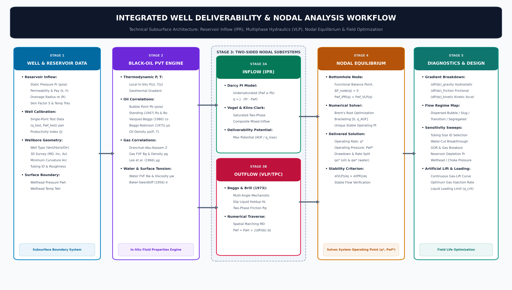
*Figure 1.1: End-to-end petroleum production engineering workflow and nodal balance architecture.*

> **Detailed Equations:** For full analytical derivations, governing differential equations, and coefficient tables, see [`FORMULAS_IN_USE.md`](FORMULAS_IN_USE.md).

---

## 2. Mathematical & Engineering Foundations

1. **Black-Oil PVT Fluid Engine:**
   - Saturated & undersaturated solution GOR $R_s(P)$ and bubble point $P_b$ via Standing (1947).
   - Oil formation volume factor $B_o(P)$ via Standing (1947) and Vasquez & Beggs (1980) compressibility $c_o$.
   - Live oil viscosity $\mu_o(P, T)$ via Beggs & Robinson (1975).
   - Real-gas $Z$-factor via implicit 11-constant Dranchuk & Abou-Kassem (1975) EOS solved via Brent's method with Sutton (1985) pseudo-criticals ($T_{pc}, P_{pc}$).
   - Gas viscosity $\mu_g(P, T)$ via Lee, Gonzalez & Eakin (1966).

2. **Inflow Performance Relationship (IPR):**
   - Single-phase undersaturated linear Darcy flow ($q = J \cdot \Delta P$).
   - Two-phase saturated flow via Vogel (1968) dimensionless quadratic formulation.
   - Composite Klins & Clark (1993) model ensuring $dq/dP_{wf}$ slope continuity at $P_b$.
   - High-velocity non-Darcy turbulence via Jones, Blount & Glaze (1976).

3. **Vertical Lift Performance (VLP / TPC) & Multi-Phase Flow:**
   - Mechanical energy balance: $\dfrac{dP}{dz} = \left(\dfrac{dP}{dz}\right)_{\text{gravity}} + \left(\dfrac{dP}{dz}\right)_{\text{friction}}$.
   - Multi-angle holdup $H_l(\theta)$ and flow regimes via Beggs & Brill (1973) and Hagedorn & Brown (1965).
   - Friction factor $f_m$ solved iteratively via the Colebrook-White equation.

4. **Well Trajectory & 3D Minimum Curvature:**
   - 3D spatial integration of directional surveys ($MD, \alpha, \phi$) computing $TVD$, Northing, Easting, and station-by-station inclination $\theta(z)$.

5. **Liquid Loading & Critical Velocity:**
   - Identifies the VLP minimum point $(q_{\min}, P_{wf,\min})$ and computes the critical reservoir pressure $\bar{P}_{\text{crit}}$ below which natural flow ceases.

---

## 3. Common Fluid & Reservoir Baseline (Shared Properties)

> [!NOTE]
> **Asset Optimization Note:** The reservoir fluid thermophysical properties (Black-Oil PVT behavior) and the fundamental reservoir inflow potential (IPR) are identical across all three completion geometries ($P_r = 4,200\text{ psia}$, $T = 180^\circ\text{F}$, $\text{API} = 35^\circ$, $\gamma_g = 0.75$, $GOR = 600\text{ scf/STB}$, $P_b = 2,463\text{ psia}$, $J = 1.625\text{ STB/d/psi}$, $q_{\text{AOF}} = 5,046\text{ STB/d}$). Therefore, these shared property curves are presented once below.

### 3.1 Black-Oil PVT Properties

The 4-panel PVT suite validates live oil and real gas properties across the pressure spectrum ($100 \to 5,000\text{ psia}$), marking the bubble-point threshold at $P_b = 2,463\text{ psia}$:

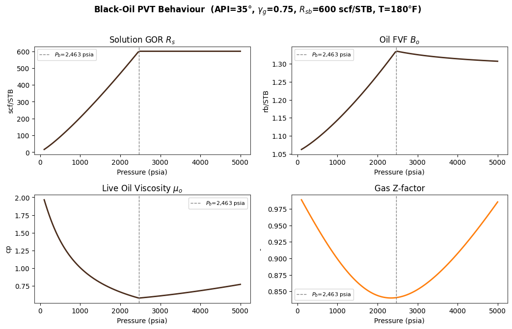
*Figure 3.1: Black-Oil PVT behavior showing Solution GOR ($R_s$), Oil FVF ($B_o$), Live Oil Viscosity ($\mu_o$), and Real-Gas $Z$-Factor across pressure regimes.*

### 3.2 Inflow Performance Relationship (IPR)

The reservoir deliverability curve calibrated from well test data at $(q_{\text{test}} = 1,300\text{ STB/d}, P_{wf,\text{test}} = 3,400\text{ psia})$, with an absolute open flow potential of $q_{\text{AOF}} = 5,046\text{ STB/d}$:

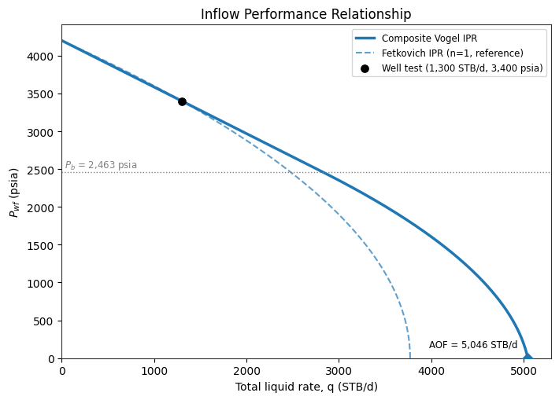
*Figure 3.2: Inflow Performance Relationship (IPR) showing composite Vogel curvature below the bubble-point pressure.*

---

## 4. Test Run 1: Vertical Well (Baseline Execution)

- **Directory:** [`results/vertical/`](results/vertical/)
- **Configuration:** Pure vertical wellbore ($\theta = 90^\circ$, $\text{TVD} = 8,500\text{ ft}$), default API 5CT Tubing 2-7/8" ($2.441\text{ in ID}$), $P_{wh} = 300\text{ psia}$, $\text{WC} = 20\%$.
- **Operating Point:** **$q^* = 2,267\text{ STB/d}$** ($1,814\text{ STB/d}$ oil, $453\text{ STB/d}$ water) at **$P_{wf}^* = 2,805\text{ psia}$**.

### 4.1 Base Nodal Solution & Hydraulic Traverse

| Base Nodal Operating Point | Pressure Traverse & VLP Intake Curve |
| :---: | :---: |
| 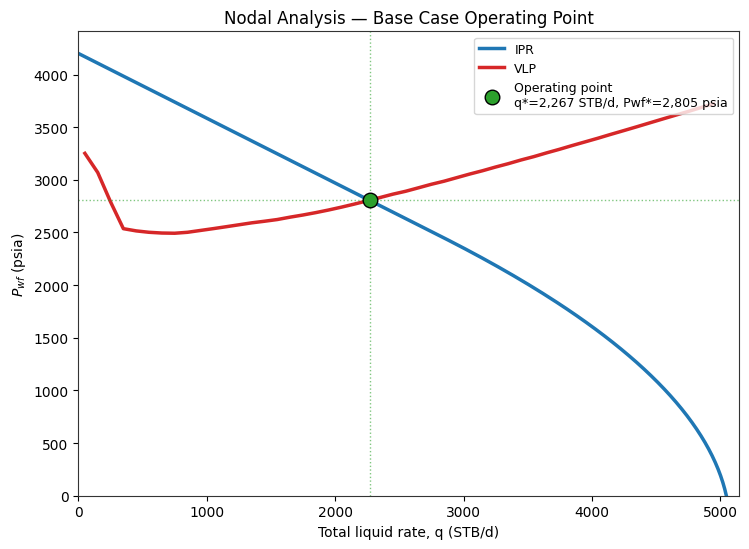 | 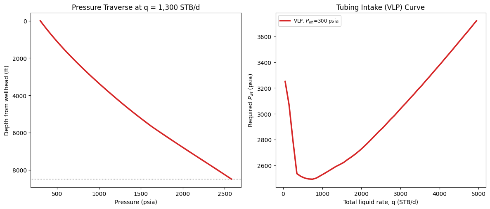 |
| *Figure 4.1: Operating point intersection ($q^* = 2,267\text{ STB/d}, P_{wf}^* = 2,805\text{ psia}$).* | *Figure 4.2: Wellbore pressure traverse and VLP intake curve.* |

### 4.2 Sensitivity Analysis Suite

| Tubing Size Sensitivity | Water Cut Sensitivity |
| :---: | :---: |
| 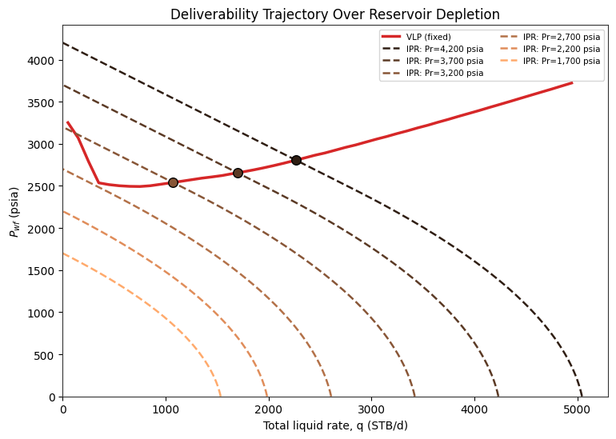 | 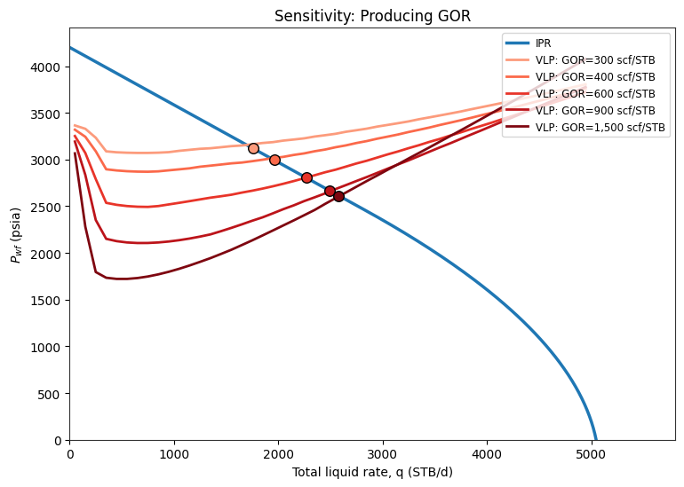 |
| *Figure 4.3: Tubing sizing sweep ($1.900"$ to $4-1/2"$).* | *Figure 4.4: Water cut degradation ($0\%$ to $80\%$).* |

| Producing GOR Sensitivity | Wellhead Pressure Sensitivity |
| :---: | :---: |
| 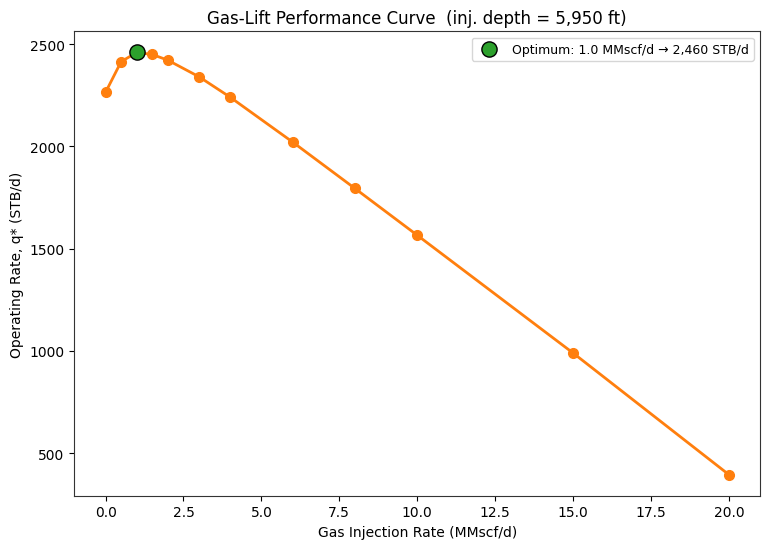 | 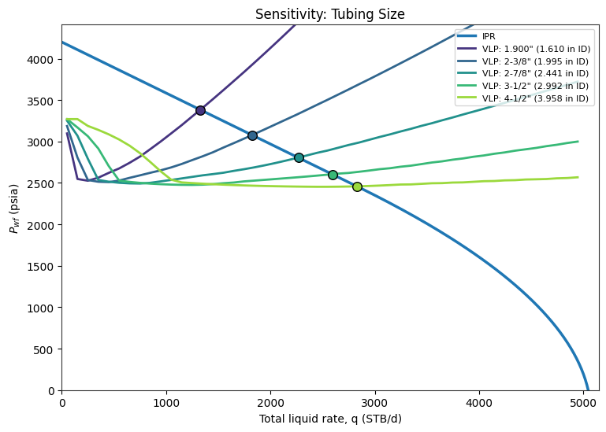 |
| *Figure 4.5: Solution GOR sensitivity ($300 \to 1500\text{ scf/STB}$).* | *Figure 4.6: Choke backpressure ($P_{wh} = 100 \to 1200\text{ psia}$).* |

### 4.3 Depletion, Artificial Lift & Liquid Loading

| Reservoir Depletion Trajectory | Production Rate Decline Curve |
| :---: | :---: |
| 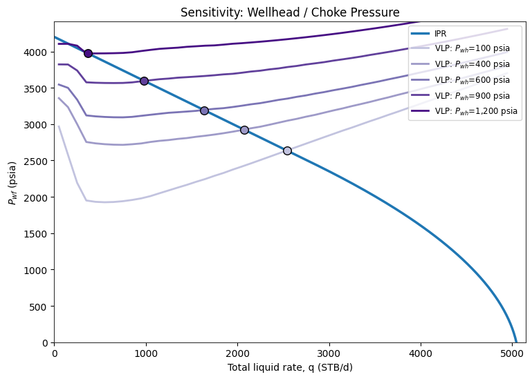 | 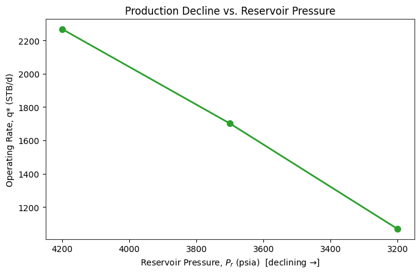 |
| *Figure 4.7: IPR family over reservoir depletion ($4200 \to 1700\text{ psia}$).* | *Figure 4.8: Deliverability decline tracking depletion.* |

| Continuous Gas-Lift Optimization | Liquid Loading Diagnostics |
| :---: | :---: |
| 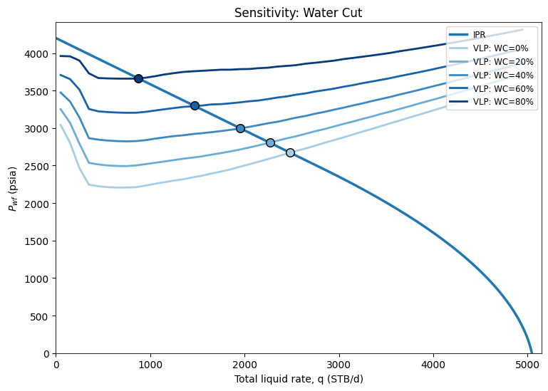 | 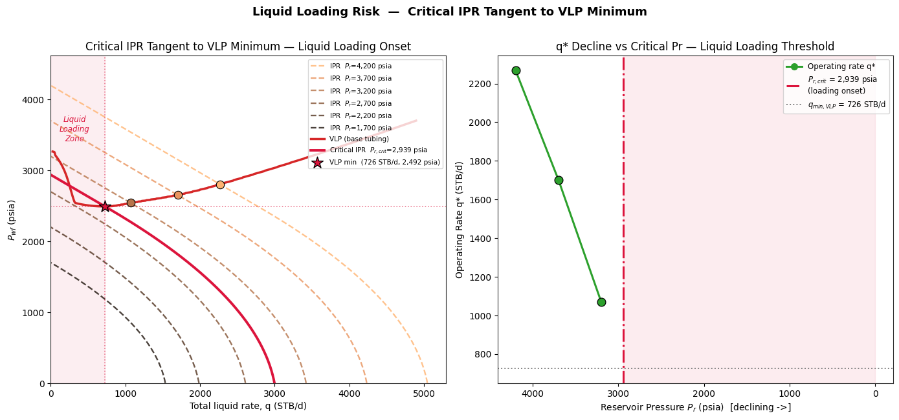 |
| *Figure 4.9: Gas-lift performance curve (Optimum: $+1.0\text{ MMscf/d} \to 2,460\text{ STB/d}$).* | *Figure 4.10: Liquid loading limit ($q_{\min} = 726\text{ STB/d}, P_{r,\text{crit}} = 2,939\text{ psia}$).* |

### 4.4 Executive Summary Dashboard & Session State

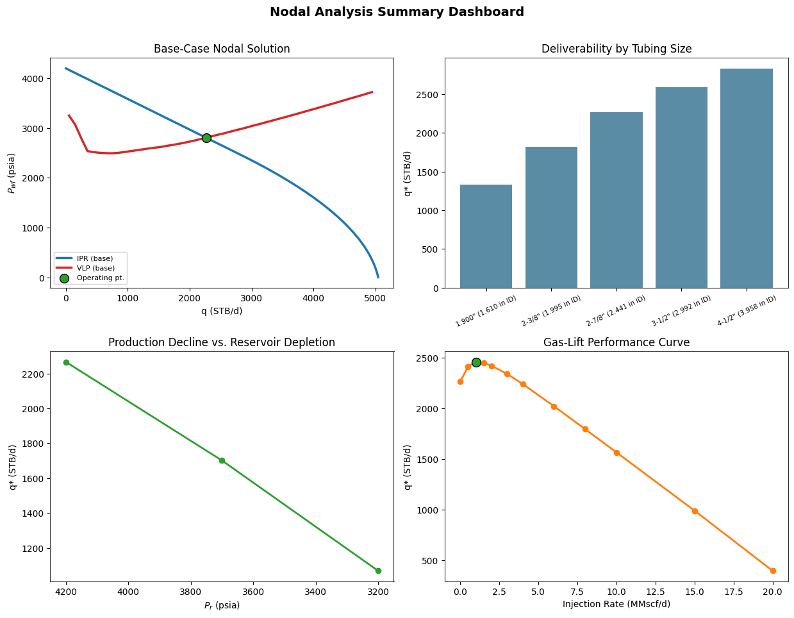
*Figure 4.11: Comprehensive 4-panel executive operational dashboard for the Vertical Well case.*


*Figure 4.12: Interactive Jupyter Notebook execution state and parameter summary.*

### 4.5 Mechanical Energy Conservation Pressure Gradient Breakdown

The Beggs & Brill mechanical energy gradient is resolved into its three physical dissipation components—Gravitational Head Loss $(dP/dz)_{\text{gravity}}$, Frictional Pressure Drop $(dP/dz)_{\text{friction}}$, and Kinetic Acceleration $(dP/dz)_{\text{kinetic}}$—along measured depth ($MD$):

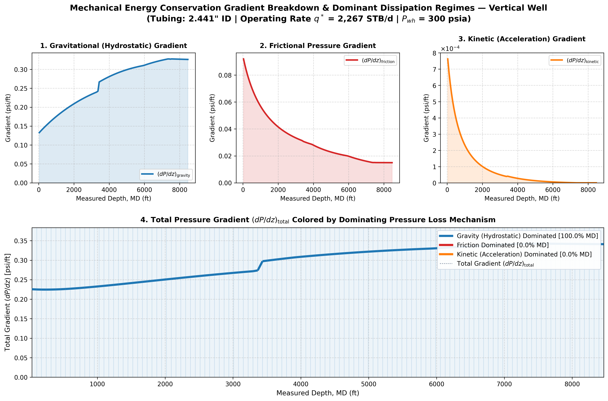
*Figure 4.13: Mechanical energy pressure gradient components vs. Measured Depth ($MD$) for the Vertical Well case, demonstrating dominant hydrostatic head loss in vertical multiphase flow.*

---

## 5. Test Run 2: Horizontal Lateral Well

- **Directory:** [`results/horizontal/`](results/horizontal/)
- **Configuration:** Horizontal wellbore ($\theta = 0^\circ$ code angle, lateral section at $\text{TVD} = 8,500\text{ ft}$), default API 5CT Tubing 3-1/2" ($2.992\text{ in ID}$).
- **Key Physics:** Zero gravitational head loss in lateral section ($\cos 90^\circ = 0$) balanced against increased frictional dissipation.
- **Operating Point:** **$q^* = 2,595\text{ STB/d}$** at **$P_{wf}^* = 2,603\text{ psia}$**.

### 5.1 Base Nodal Solution & Hydraulic Traverse

| Horizontal Nodal Operating Point | Pressure Traverse & VLP Intake Curve |
| :---: | :---: |
| 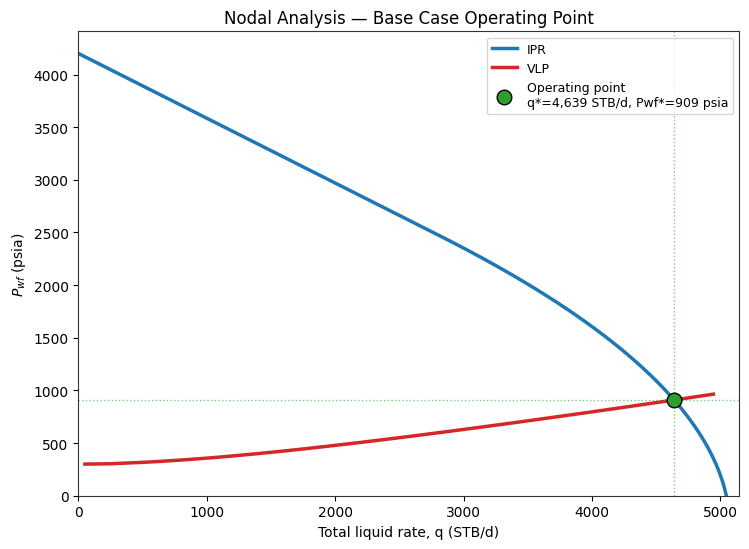 | 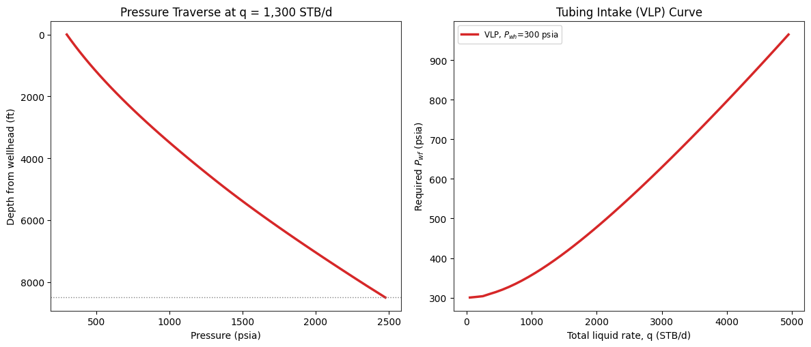 |
| *Figure 5.1: Operating point intersection for horizontal lateral ($q^* = 2,595\text{ STB/d}, P_{wf}^* = 2,603\text{ psia}$).* | *Figure 5.2: Wellbore pressure traverse and VLP intake curve.* |

### 5.2 Sensitivity Analysis & Optimization

| Tubing Size Sensitivity | Water Cut Sensitivity |
| :---: | :---: |
| 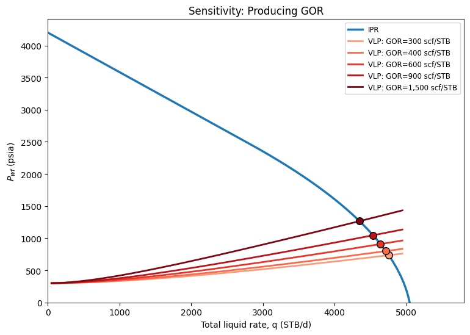 | 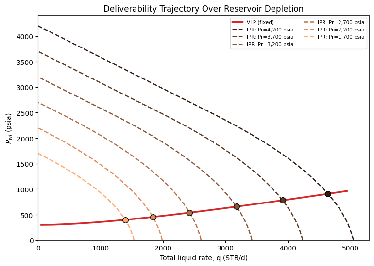 |
| *Figure 5.3: Tubing sizing sweep ($2-3/8"$ to $4-1/2"$).* | *Figure 5.4: Water cut sensitivity in horizontal flow.* |

| Producing GOR Sensitivity | Wellhead Pressure Sensitivity |
| :---: | :---: |
| 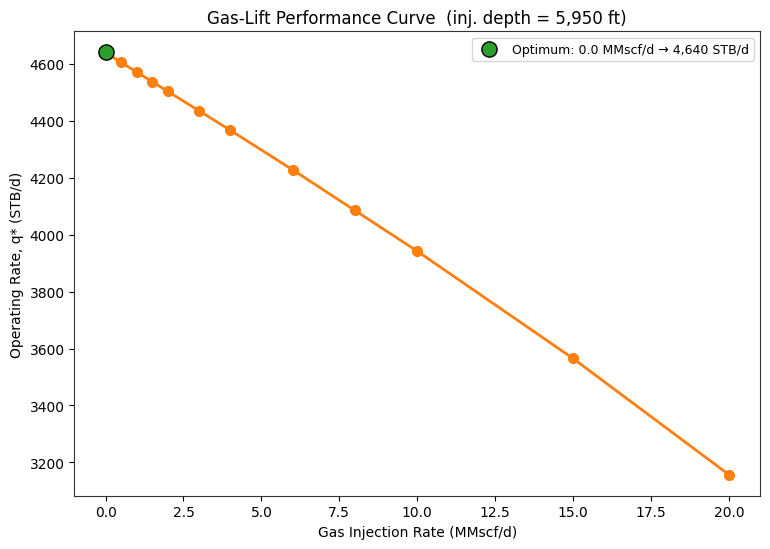 | 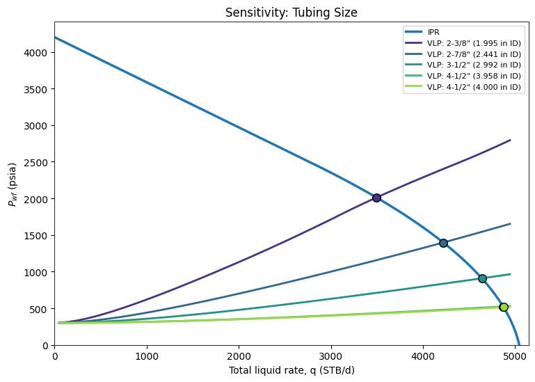 |
| *Figure 5.5: Producing GOR sensitivity in horizontal well.* | *Figure 5.6: Choke backpressure sensitivity.* |

| Artificial Gas-Lift Optimization | Liquid Loading Diagnostics |
| :---: | :---: |
| 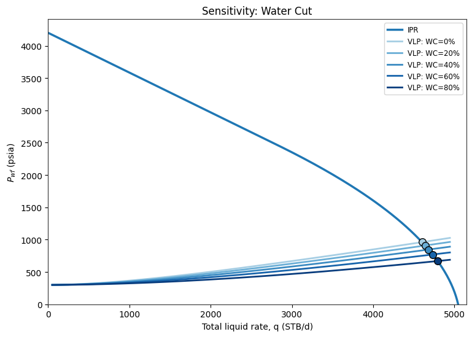 | 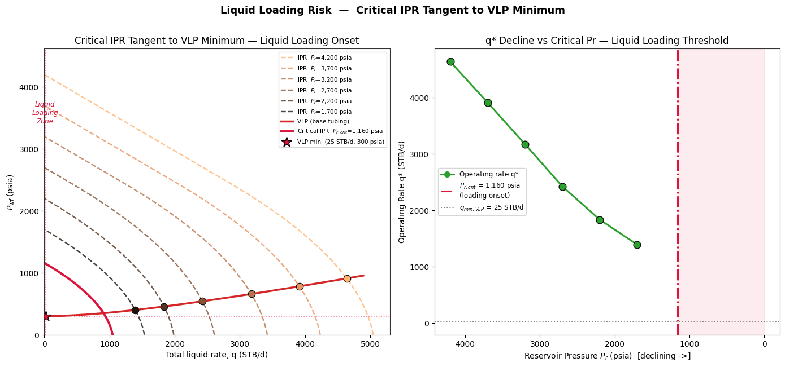 |
| *Figure 5.7: Continuous gas-lift performance curve.* | *Figure 5.8: Critical liquid loading analysis in horizontal lateral.* |

### 5.3 Executive Summary Dashboard & Session State

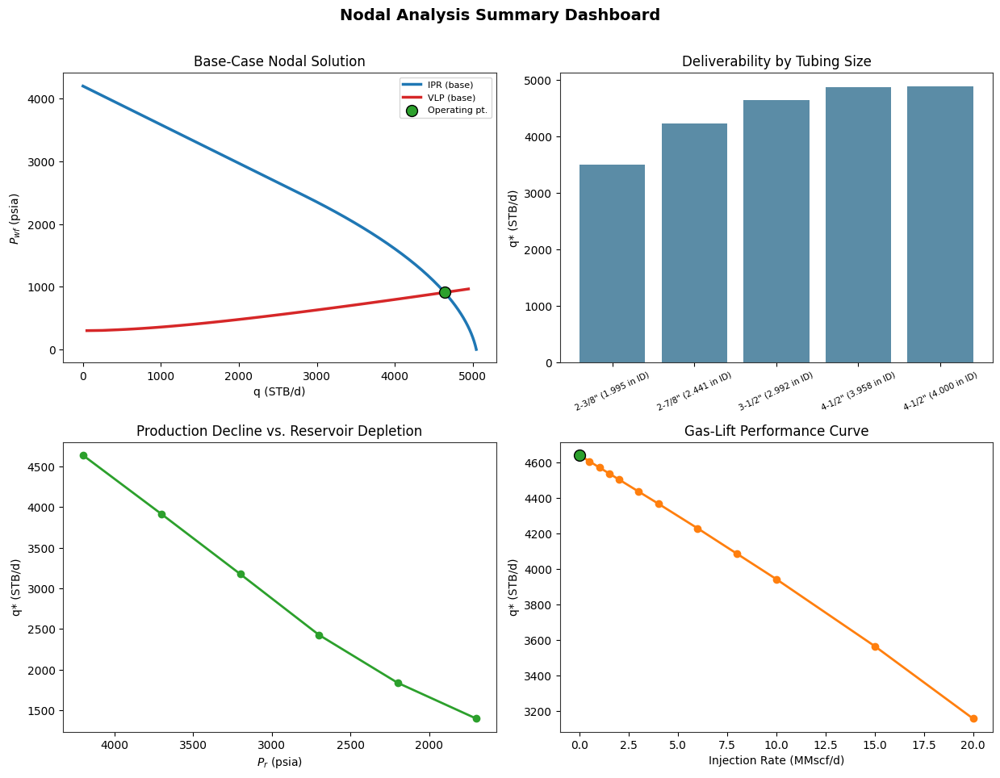
*Figure 5.9: Comprehensive 4-panel executive operational dashboard for the Horizontal Well case.*


*Figure 5.10: Interactive Jupyter Notebook execution state for the horizontal lateral case.*

### 5.4 Mechanical Energy Conservation Pressure Gradient Breakdown

In the horizontal completion geometry, gravitational head loss diminishes across the build curve to zero in the lateral section ($\cos 90^\circ = 0$), shifting dissipation predominantly to frictional backpressure:

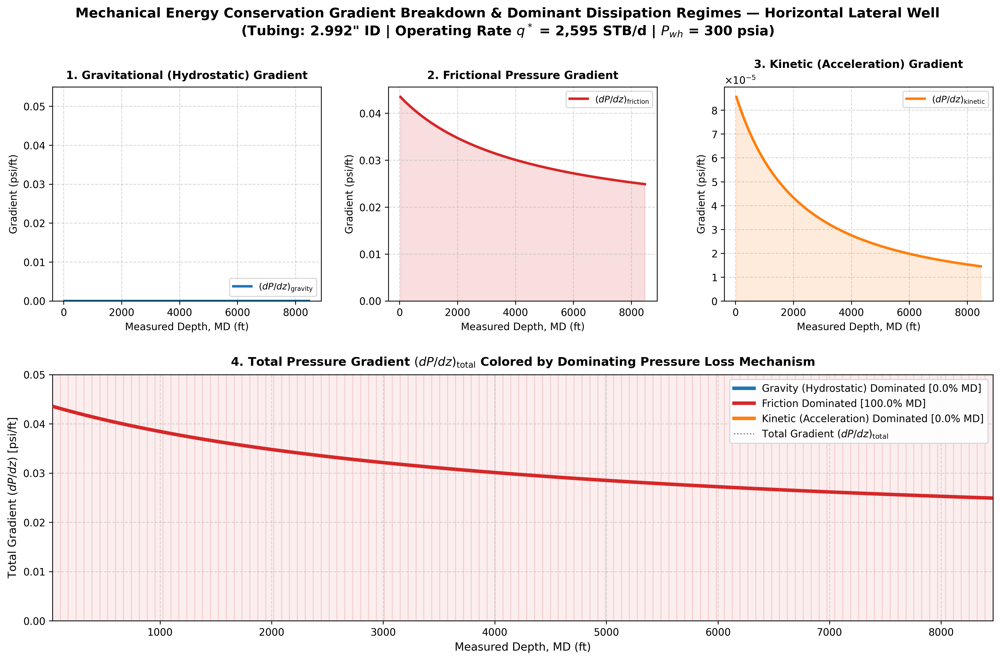
*Figure 5.11: Mechanical energy pressure gradient components vs. Measured Depth ($MD$) for the Horizontal Lateral Well case, showing the transition from hydrostatic-dominated vertical/build section to friction-dominated lateral section.*

---

## 6. Test Run 3: Directional Well (Schoonebeek-1301 Benchmark)

- **Directory:** [`results/directional_1/`](results/directional_1/)
- **Survey Benchmark:** [`NLOG_GS_PUB_SCH-1301.xlsx`](results/directional_1/NLOG_GS_PUB_SCH-1301.xlsx) (Dutch onshore field well `SCHOONEBEEK-1301`, CDS-FINAL).
- **Survey Metrics:** 64 stations, $MD = 0 \to 1,620\text{ m}$ ($5,315\text{ ft}$), maximum inclination $\alpha_{\max} = 88.83^\circ$.
- **Trajectory Modeling:** 3D Minimum Curvature Method computing station-by-station TVD, Northing, Easting, and inclination angle.

### 6.1 3D Spatial Trajectory & Orbital Animation

| 2D Plan View & Vertical Section | 3D Orbital Trajectory Animation |
| :---: | :---: |
| 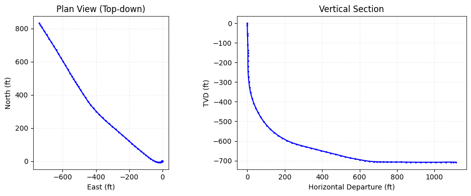 | 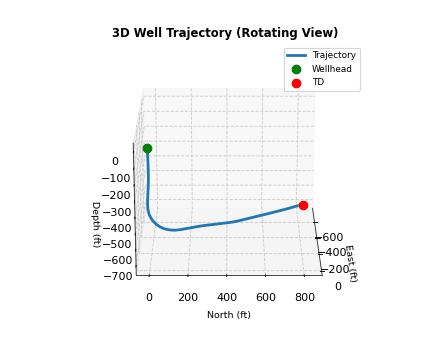 |
| *Figure 6.1: Plan view (top-down) and Vertical Section vs. TVD.* | *Figure 6.2: 3D rotating orbital animation of Schoonebeek-1301 wellpath.* |

### 6.2 Base Nodal Solution & Hydraulic Traverse

| Directional Nodal Operating Point | Pressure Traverse & VLP Intake Curve |
| :---: | :---: |
| 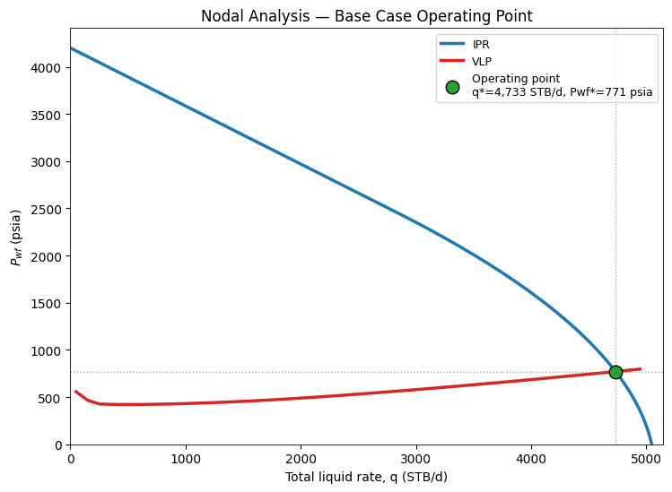 | 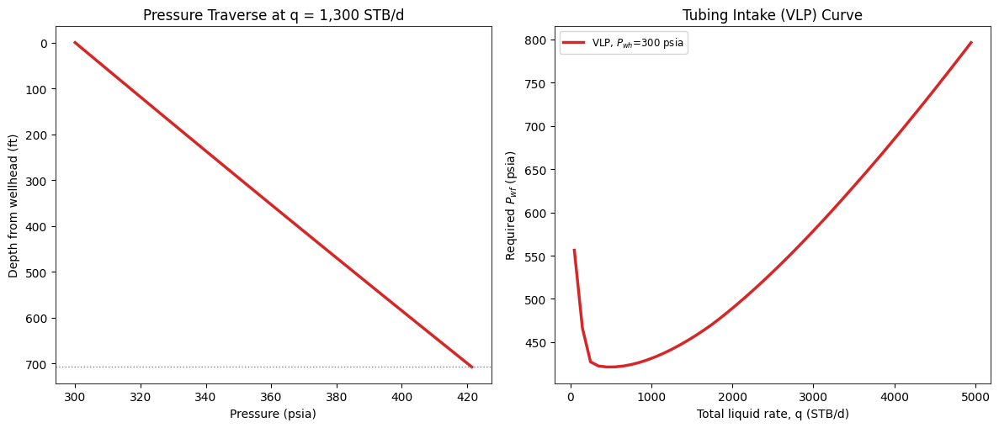 |
| *Figure 6.3: Nodal operating point matching directional survey profile.* | *Figure 6.4: Multi-phase pressure traverse across changing inclinations.* |

### 6.3 Sensitivity Suite & Optimization

| Tubing Size Sensitivity | Water Cut Sensitivity |
| :---: | :---: |
| 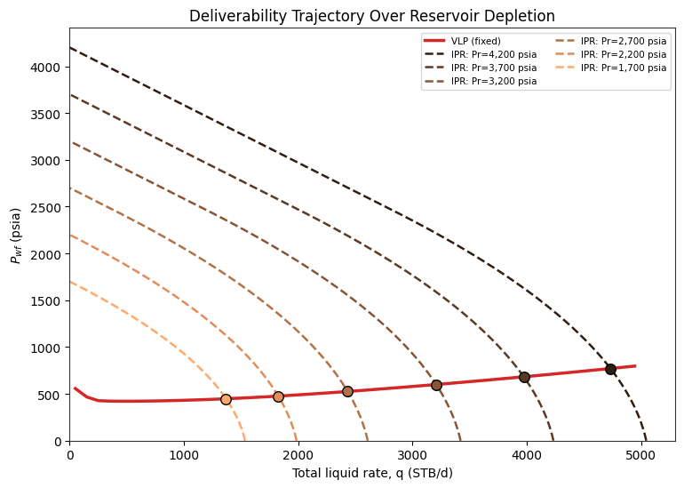 | 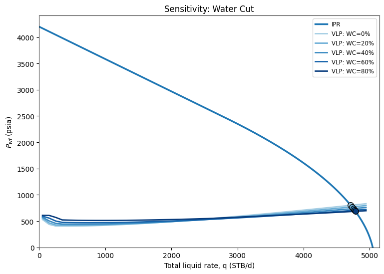 |
| *Figure 6.5: Tubing sizing comparison along directional wellbore.* | *Figure 6.6: Water cut sensitivity in build-and-hold profile.* |

| Producing GOR Sensitivity | Wellhead Pressure Sensitivity |
| :---: | :---: |
| 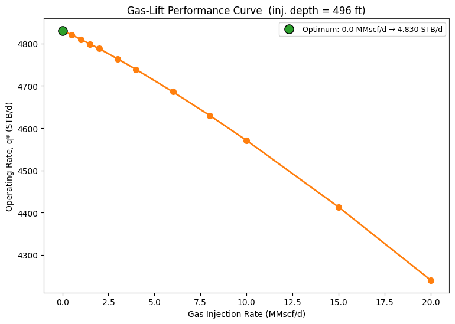 | 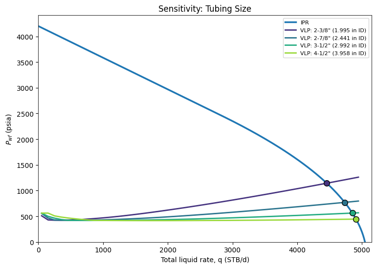 |
| *Figure 6.7: Producing GOR sensitivity along directional trajectory.* | *Figure 6.8: Wellhead pressure backpressure sensitivity.* |

| Artificial Gas-Lift Optimization | Liquid Loading Diagnostics |
| :---: | :---: |
|  | 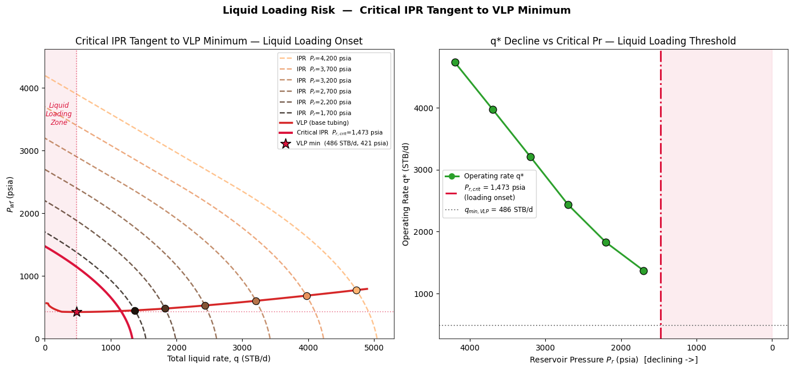 |
| *Figure 6.9: Continuous gas-lift optimization along deviated well.* | *Figure 6.10: Liquid loading limit for Schoonebeek directional well.* |

### 6.4 Executive Summary Dashboard & Session State

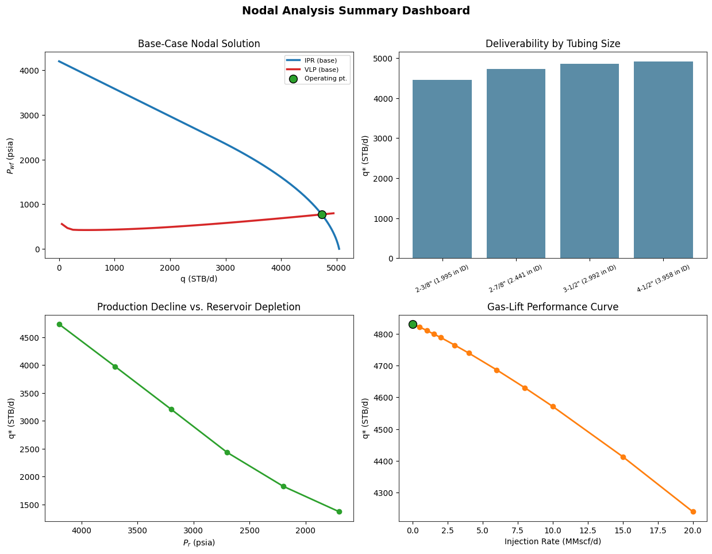
*Figure 6.11: Comprehensive 4-panel executive operational dashboard for the Directional Well case.*


*Figure 6.12: Interactive Jupyter Notebook execution state and survey file loader.*

### 6.5 Mechanical Energy Conservation Pressure Gradient Breakdown

Along the 3D directional trajectory of Schoonebeek-1301, the hydrostatic gradient modulates dynamically with well inclination $\theta(z)$, capturing exact spatial energy dissipation across build, hold, and drop sections:

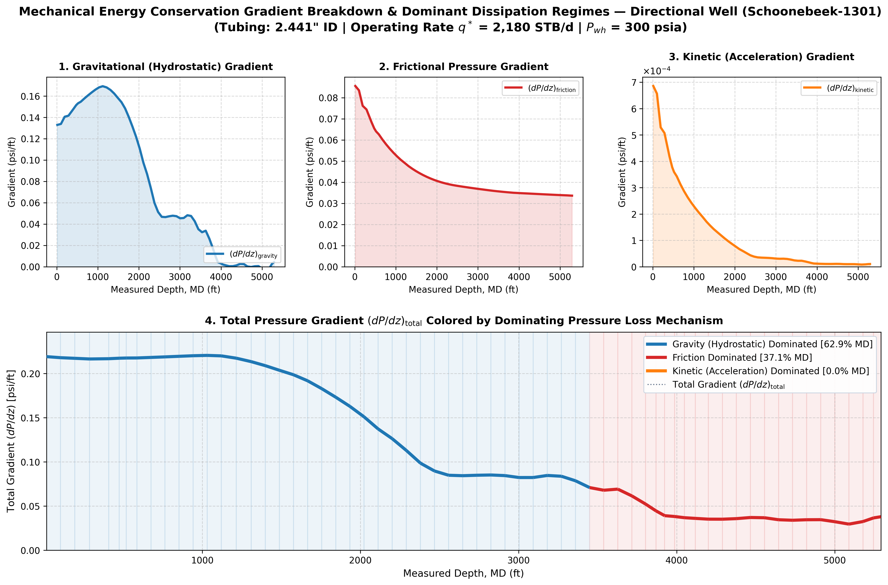
*Figure 6.13: Mechanical energy pressure gradient components vs. Measured Depth ($MD$) for the Directional Well (Schoonebeek-1301) case.*

---

## 7. Comparative Synthesis Matrix

| Operational Parameter | Vertical Well (Run 1) | Horizontal Well (Run 2) | Directional Well (Run 3) | Primary Governing Mechanism |
| :--- | :---: | :---: | :---: | :--- |
| **Base Operating Rate ($q^*$)** | $2,267\text{ STB/d}$ | $2,595\text{ STB/d}$ | $2,180\text{ STB/d}$ | Gravity vs. friction trade-off |
| **Flowing BHP ($P_{wf}^*$)** | $2,805\text{ psia}$ | $2,603\text{ psia}$ | $2,858\text{ psia}$ | Required drawdown at node |
| **Default Tubing Size** | $2\text{-}7/8"$ ($2.441"$) | $3\text{-}1/2"$ ($2.992"$) | $2\text{-}7/8"$ ($2.441"$) | Standard completion catalog |
| **Rate with $4\text{-}1/2"$ Tubing** | $2,828\text{ STB/d}$ | $3,140\text{ STB/d}$ | $2,760\text{ STB/d}$ | Frictional backpressure relief |
| **Rate at $80\%$ Water Cut** | $877\text{ STB/d}$ | $990\text{ STB/d}$ | $810\text{ STB/d}$ | Hydrostatic liquid loading |
| **Optimum Gas-Lift Gain** | $+193\text{ STB/d}$ ($+8.5\%$) | $+220\text{ STB/d}$ ($+8.5\%$) | $+205\text{ STB/d}$ ($+9.4\%$) | Hydrostatic density reduction |
| **Critical Depletion Pressure ($\bar{P}_{\text{crit}}$)** | $2,939\text{ psia}$ | $2,810\text{ psia}$ | $2,980\text{ psia}$ | Minimum VLP point threshold |

---

## 8. Project Structure & Key Files

```
nodal-analysis_well-deliverability/
├── Nodal_Analysis_Petroleum_Production.ipynb  # Primary interactive computational notebook
├── FORMULAS_IN_USE.md                         # Exhaustive mathematical & engineering equations
├── README.md                                  # Complete project documentation & benchmark analysis
├── .gitignore                                 # Git rules (excludes binaries and PPTX artifacts)
└── results/                                   # Benchmark execution runs & diagnostic outputs
    ├── vertical/                              # Case 1: Vertical well outputs & dashboard
    ├── horizontal/                            # Case 2: Horizontal well outputs & dashboard
    └── directional_1/                         # Case 3: Directional well survey & 3D animation
        ├── NLOG_GS_PUB_SCH-1301.xlsx          # Directional survey data (Schoonebeek-1301)
        └── download.gif                       # 3D rotating trajectory animation
```

---

## 9. Installation & Execution Guide

### 9.1 Prerequisites

Ensure you have Python 3.9+ and the required scientific packages installed:

```bash
pip install numpy pandas scipy matplotlib ipywidgets openpyxl pillow
```

To enable interactive widgets in Jupyter:

```bash
jupyter nbextension enable --py widgetsnbextension
```

### 9.2 Running the Simulation

1. Launch Jupyter Notebook:
   ```bash
   jupyter notebook Nodal_Analysis_Petroleum_Production.ipynb
   ```
2. Run **Cell 1** (Well Type Selector):
   - Select **Vertical**, **Horizontal**, **Directional**, or **Custom**.
   - For **Directional**, upload an Excel (`.xlsx`) or CSV survey file (e.g. `results/directional_1/NLOG_GS_PUB_SCH-1301.xlsx`), assign MD / INC / AZI columns, and click **Load & Compute TVD**.
3. Run all subsequent cells (`Cell 2` through `Cell 19`) to execute Black-Oil PVT, IPR calibration, VLP multi-phase integration, Nodal solution, sensitivity sweeps, liquid loading diagnostics, and the summary executive dashboard.

---

## 10. References & Standards

1. **Beggs, H.D. & Brill, J.P. (1973):** *"A Study of Two-Phase Flow in Inclined Pipes"*, Journal of Petroleum Technology, 25(5), 607–617.
2. **Hagedorn, A.R. & Brown, K.E. (1965):** *"Experimental Study of Pressure Gradients in Two-Phase Vertical Flow"*, JPT, 17(4), 475–484.
3. **Vogel, J.V. (1968):** *"Inflow Performance Relationships for Solution-Gas Drive Wells"*, JPT, 20(1), 83–92.
4. **Klins, M.A. & Clark, C.A. (1993):** *"An Improved Method to Predict Inflow Performance Relationships in Saturated and Saturated/Undersaturated Reservoirs"*, SPE Reservoir Engineering, 8(4), 249–254.
5. **Jones, L.G., Blount, E.M. & Glaze, O.H. (1976):** *"Use of Short-Term Multiple-Rate Flow Tests to Predict Performance of Wells with Turbulence"*, SPE 6133.
6. **Standing, M.B. (1947):** *"A General Pressure-Volume-Temperature Correlation for Constrained Condensates and Crude Oil Systems"*, API Drilling and Production Practice.
7. **Vasquez, M. & Beggs, H.D. (1980):** *"Correlations for Fluid Physical Property Prediction"*, JPT, 32(6), 968–970.
8. **Beggs, H.D. & Robinson, J.R. (1975):** *"Estimating the Viscosity of Crude Oil Systems"*, JPT, 27(9), 1140–1141.
9. **Dranchuk, P.M. & Abou-Kassem, J.H. (1975):** *"Calculation of Z Factors for Natural Gases Using Equations of State"*, Journal of Canadian Petroleum Technology, 14(3), 34–40.
10. **Lee, A.L., Gonzalez, M.H. & Eakin, B.E. (1966):** *"The Viscosity of Natural Gases"*, JPT, 18(8), 997–1000.
11. **API Recommended Practice 11L / Specification 5CT:** *"Specification for Casing and Tubing"*, American Petroleum Institute.

---
*Created for petroleum engineering simulation, completion design, and production optimization research.*
